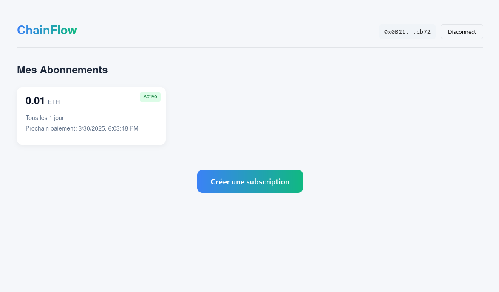

# ChainFlow  

ChainFlow is an innovative solution for managing subscriptions on EVM blockchains.  
Combined with Chainlink Automation and using the new EIP 7702, ChainFlow automates recurring transactions for subscription management.  

  
More images [here](./img/)  

## Features  

- **Multiple subscription creation**: Each user can create multiple subscriptions based on their needs.  
- **Customizable intervals**: Choose intervals in seconds, hours, or days.  
- **Multi-currency support**: Perform transactions in Ethereum or ERC20 tokens.  
- **Automated payments**: Transactions are executed automatically using Chainlink Automation.  
- **User-friendly interface**: An intuitive front-end allows users to create, view, pause, or delete subscriptions in just a few clicks.  

## Installation  

### Front-end  

```bash
cd app/
npm install
npm run serve
```  
Add a `.env` file following the structure of `.env.example`:  
Enabling `DEVMODE` allows the use of a local wallet with a private key on the front-end.  

### Smart Contracts  

```bash
cd contracts/
forge install
npm install
```  

## Usage  

1. Connect your wallet via the front-end interface.  
2. Create a subscription by defining the interval, amount (in Ether or ERC20), and other parameters.  
3. View your active subscriptions, pause them, or delete them directly from the interface.  

## Deployment  

### Addresses on the Sepolia testnet  
- LINK token: `0x779877a7b0d9e8603169ddbd7836e478b4624789`  
- Registrar: `0xb0E49c5D0d05cbc241d68c05BC5BA1d1B7B72976`  
- Registry: `0x86EFBD0b6736Bed994962f9797049422A3A8E8Ad`  

#### V1.0:  
- ChainflowContract: `0x8a910720406Ce2109FAb303BdEbeD6a2f961D81E`  
- ChainflowPayment: `0x973c5F90d1Fdd41c7befD3b2dcA48f73609A3b46`  

## Contributions  

Contributions are welcome!  
If you would like to suggest improvements or report issues, please create an issue or submit a pull request on GitHub.  
